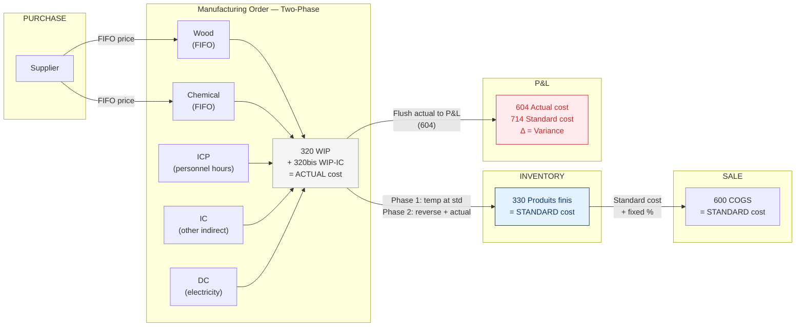
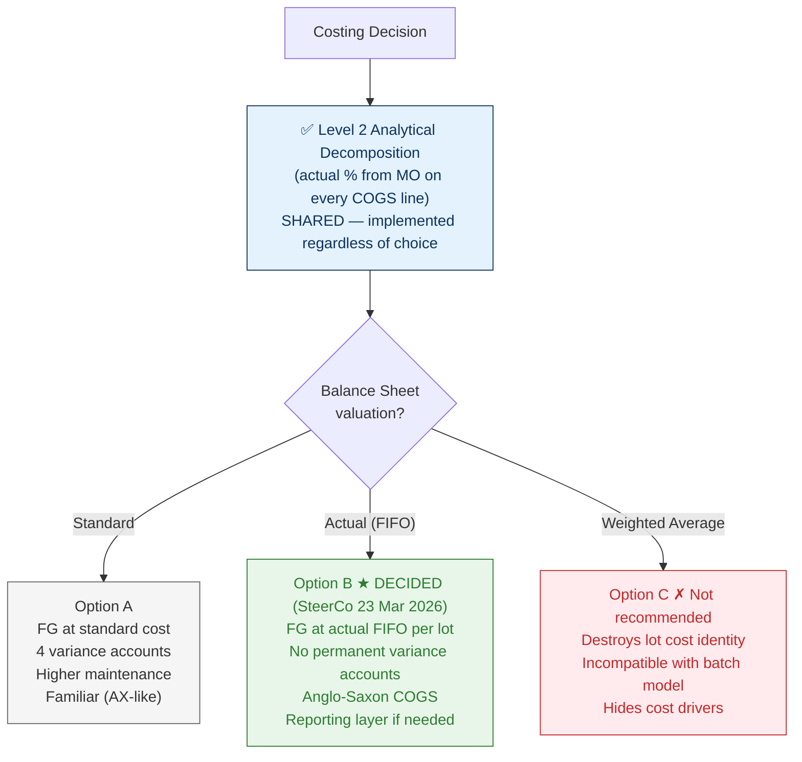

# Costing Architecture & COGS Decomposition

**Scope**: Kebony BNV (Belgian manufacturing entity) — Odoo 19
**Module**: `kebony_manufacturing` + `kebony_bol_report`
**Entity filter**: `x_kebony_entity_type == 'bnv'`
**Status**: Architecture Decision — pending CFO approval
**Go-live target**: July 1, 2026

> This document defines the costing model for Kebony's manufacturing
> operations: how raw material costs, conversion costs, and subcontracting
> costs flow through inventory into COGS, and how the cost structure is
> made visible in margin analysis.
>
> It does NOT cover US-specific accruals or commissions
> (see [[Accounting & Margin Architecture]]), wood metrics
> (see [[Metrics & Physical Units]]), or manufacturing planning
> (see [[Implementation White Paper]]).

---

## 1. Executive Summary

Kebony's manufacturing cost flow has five cost components:

1. **Wood** — raw timber (white wood), valued at FIFO purchase price
2. **Chemicals** — furfuryl alcohol and mix components, valued at FIFO
3. **Packaging** — packaging materials, valued at FIFO purchase price
4. **Conversion** — stacking, autoclave, and dryer operations, valued at work centre hourly rates
5. **Machining** — external subcontracting (RDK), valued at standard rate from volume-dependent price list

Additionally, **transfer costs** (freight from supplier or external warehouse to plant) are capitalised into inventory cost, while **external warehousing costs** are treated as period expenses (see Section 10).

The architecture must answer three questions:

- **At what cost do WIP and Finished Goods sit on the balance sheet?**
- **When goods are sold, how is COGS decomposed by cost component?**
- **How are variances (actual vs. absorbed) treated?**

Two options are presented. Both share the same COGS analytical decomposition mechanism (Level 2). They differ in how inventory is valued.

---

## 2. Current State (AX) — As-Is

> Source: Production Order PO-019357 (KRRS 50x150mm, February 2026) — T-schema and financial postings extracted from AX. Belgian PCMN accounts shown as primary; Norwegian AX accounts in parentheses.

### 2.1 Account Structure

The AX system uses a segmented account string that encodes item group, cost centre, and warehouse in a single ledger code. Below is the mapping to Belgian PCMN.

**Balance Sheet accounts:**

| PCMN | Description | AX account | Role |
|------|-------------|------------|------|
| 300 | Matieres premieres — Bois blanc | 1400--R--2490 | Raw wood inventory (FIFO) |
| 301 | Matieres premieres — Chimie (Ready-Mix) | 1400--MIX--2615 | Chemical mix inventory (FIFO) |
| 330 | Produits finis | 1440--KRRS--2489 | Finished goods (standard cost) |
| 330bis | Produits finis — offset WIP | 1441--KRRS--2489 | Temporary FG offset (reversed at PO close) |
| 320 | En-cours — Kebonisation (WIP) | 1492 | Work-in-process clearing (materials + mix) |
| 320bis | En-cours — Indirect / Direct costs (WIP) | 1493 | Work-in-process clearing (conversion + DC) |

**P&L accounts:**

| PCMN | Description | AX account | Role |
|------|-------------|------------|------|
| — | Indirect cost — personnel | 4501-30-BEL--ICP--1290 | Kebony hours: personnel portion |
| — | Indirect cost — other | 4501-30-BEL--IC--1292 | Kebony hours: other indirect portion |
| — | Direct cost — electricity / utilities | 4961-30-NOR--DC--4025 (4960) | Direct cost per m3 processed |
| 604 | Ecart de production — actual cost | 4226-30-NOR | Substitution variance (actual cost of PO) |
| 714 | Variation des stocks — standard cost | 4227-30-NOR | Rounding variance (standard cost capitalised) |

### 2.2 Five Cost Components

A production order consumes five distinct cost components:

| # | Component | AX Item | Unit | Example (PO-019357) | Nature |
|---|-----------|---------|------|---------------------|--------|
| 1 | **Raw wood** | 2490 (Radiata 50x150) | 1,969 m (14.77 m3) | 138,573 NOK | Material — FIFO purchase price |
| 2 | **Chemical mix** | 2615 (FA Mix 55) | 9,850 liters (665 L/m3) | 60,178 NOK | Material — FIFO |
| 3 | **Indirect cost — personnel** (ICP) | 1290 | 17.56 Kebony hours (1.17 h/m3) | 18,104 NOK | Conversion — absorbed at hourly rate |
| 4 | **Indirect cost — other** (IC) | 1292 | 17.56 Kebony hours (1.17 h/m3) | 15,558 NOK | Conversion — absorbed at hourly rate |
| 5 | **Direct cost — electricity etc.** (DC) | 4025 | 15.01 m3 processed | 19,768 NOK | Direct — absorbed per m3 |

**Output:** 1,975 meters (14.81 m3) of KRRS 50x150mm — 10 finished lots (FA2600356 to FA2600390).

> **Note on conversion:** AX uses a single "Kebony hour" rate applied to two sub-accounts (ICP for personnel, IC for other). The same hours drive both. In the Odoo target, this single rate is split into three work centre pools (Stacking, Autoclave, Dryer) — see §5.

### 2.3 Two-Phase Posting Model

AX uses a **two-phase** posting model for production orders. This is a key structural difference with the Odoo target.

#### Phase 1 — WIP Input (at picking / production start, standard cost)

Materials are picked and conversion costs are absorbed at **standard cost** into temporary WIP accounts:

```
Materials:
  DR  320  En-cours (WIP)                    138,344  (1492 in AX)
      CR  300  Matieres premieres — Bois     138,344  (1400--R--2490)

  DR  320  En-cours (WIP)                     60,363  (1492 in AX)
      CR  301  Matieres premieres — Chimie    60,363  (1400--MIX--2615)

Conversion (via WIP-Indirect):
  DR  320bis En-cours indirect (WIP-IC)       18,104  (1493 in AX)
      CR  —   Indirect cost personnel         18,104  (4501--ICP--1290)

  DR  320bis En-cours indirect (WIP-IC)       15,558  (1493 in AX)
      CR  —   Indirect cost other             15,558  (4501--IC--1292)

  DR  320bis En-cours indirect (WIP-IC)       19,768  (1493 in AX)
      CR  —   Direct cost electricity         19,768  (4961--DC--4025)
```

#### Phase 1 — WIP Output (report as finished, standard cost)

Finished goods are reported at **standard cost** using a temporary offset account:

```
  DR  330     Produits finis (FG)             259,726  (1440 in AX)
      CR  330bis  FG offset / WIP-out        259,726  (1441 in AX)
```

> At this point, FG is on the balance sheet at standard cost. The offset account (330bis / 1441) acts as a temporary clearing account — it will be reversed when the PO is closed.

#### Phase 2 — Closing the Production Order

When the PO is closed, **all temporary postings from Phase 1 are reversed**, then **actual costs** are posted, and **variances** are recognised:

```
Step 1: Reverse all Phase 1 temporary entries
        (all entries above are reversed — net effect: 320, 320bis, 330, 330bis return to zero)

Step 2: Post actual material costs through WIP
  DR  320  En-cours (WIP)                    138,573  (actual — slightly higher than std)
      CR  300  Matieres premieres — Bois     138,573

  DR  320  En-cours (WIP)                     60,178  (actual — slightly lower than std)
      CR  301  Matieres premieres — Chimie    60,178

Step 3: Post actual conversion costs through WIP
  DR  320  En-cours (WIP)                     18,104  (ICP)
      CR  —   Indirect cost personnel         18,104

  DR  320  En-cours (WIP)                     15,558  (IC)
      CR  —   Indirect cost other             15,558

  DR  320  En-cours (WIP)                     19,768  (DC)
      CR  —   Direct cost electricity         19,768

Step 4: Flush WIP to P&L at actual cost
  DR  604  Ecart de production (actual)      252,182  (4226 in AX)
      CR  320  En-cours (WIP)                252,182

Step 5: Capitalise FG at standard cost
  DR  330  Produits finis (FG)               259,726  (standard cost)
      CR  714  Variation des stocks (std)    259,726  (4227 in AX)
```

**Net variance** = Standard (259,726) − Actual (252,182) = **+7,544 NOK favourable**.

The variance sits in the P&L as the difference between account 604 (actual) and account 714 (standard). No product-level or lot-level detail is attached to the variance.

### 2.4 Cost Flow Diagram (AX)



### 2.5 COGS Split at Sale

When FG is sold, COGS is posted at **standard cost**. The split into cost groups (margin layers) uses **fixed standard percentages** — the same % for all products in a category, regardless of the actual cost structure of the specific lot being sold.

### 2.6 Limitations

- **Two-phase posting** adds complexity: every PO generates temporary entries that must be reversed, doubling the journal volume
- **Fixed standard %** for COGS split drifts from reality — different products (and different batches of the same product) have different actual cost structures
- **Cost detail lost at FG entry** — only the MO retains the actual breakdown; FG inventory holds a single standard number
- **Variance accounts are opaque** — 604/714 carry no product, lot, or cost-component traceability
- **Standard revision is manual** — inventory valuation drifts between revisions
- **Single Kebony hour** combines personnel, other indirect, and direct costs — no visibility into which conversion stage drives cost
- Cannot answer: "what was the actual wood cost in the lots sold to customer X?"
- Cannot answer: "why did margin drop — wood price, conversion efficiency, or product mix?"

### 2.7 As-Is → Target: Key Design Changes

The table below summarises the structural changes from AX to Odoo. The Level 2 analytical decomposition and the FG valuation choice (Option A vs B) are detailed in subsequent sections.

| Area | AX (As-Is) | Odoo (Target) | Rationale |
|------|-----------|---------------|-----------|
| **Posting model** | Two-phase: temporary at picking → reverse all → repost actual at PO close | **Hybrid (single-pass)**: materials consumed into WIP at picking (real, not temporary); WC costs absorbed as operations complete; FG created at MO completion. No reversal cycle. | Kebonisation spans days — WIP must be visible on BS for cutoff. But reversal cycle is unnecessary complexity. Hybrid gives accurate WIP without doubling journal volume. |
| **FG offset account** | 330bis / 1441 temporary offset | **Dropped** — not needed with single-pass posting | 330bis only existed to support the two-phase temp/reverse cycle. |
| **Conversion split** | Single "Kebony hour" → 2 sub-accounts by nature (ICP personnel, IC other) + 1 direct cost (DC electricity) | **Both dimensions**: 3 WC pools by stage (Stacking, Autoclave, Dryer) **and** cost tracking by nature (personnel, other, energy) via GL sub-accounts or analytic | Splitting by stage shows *where* cost is incurred (which machine). Keeping nature shows *what type* of cost (personnel vs energy). Both are needed to compute period-end variance: `Actual GL spend per pool − Σ(WC rate × hours)`. |
| **COGS split** | Fixed standard % — same for all products in a category | **Level 2**: actual % per product, per lot, traced from producing MO (see §3) | Core improvement. Actual cost structure replaces static percentages. Enables margin variance analysis by cost driver. |
| **Variance granularity** | 2 opaque accounts (4226 actual, 4227 standard) — no component, product, or lot detail | **4 explicit accounts** (Option A): 604₁ material, 604₂ conversion, 604₃ machining, 714 revaluation. **Or 1 account** (Option B): 604 machining only. Both carry analytical distribution. | AX variance is a single net number. Odoo variants are split by component and carry product-level traceability. |
| **FG valuation** | Standard cost (revised periodically) | **Open decision** — Option A (Standard) or Option B (FIFO per lot). See §4 and §5. | Pending CFO approval. Both options share Level 2 COGS decomposition. |

---

## 3. Shared Architecture: Level 2 Analytical Decomposition

Regardless of which inventory valuation option is chosen (Standard, FIFO, or otherwise), all options share the **Level 2** COGS decomposition mechanism. This is the **core improvement** over AX.

> **Level 1** (AX today) = fixed standard % applied to all products in a category.
> **Level 2** (Odoo target) = actual % per product, per lot, traced from the Manufacturing Order.

### 3.1 Concept

When a sale delivery creates a COGS journal entry, the system traces the delivered lot back to the manufacturing order that produced it. The MO's actual cost breakdown (wood, chemicals, conversion, machining) provides the **actual percentage split**. This split is applied as the analytical distribution on the COGS journal item.

**This is the minimum improvement regardless of BS valuation choice.** Even if we keep standard cost on the balance sheet (Option A), the COGS analytical distribution will use actual MO percentages instead of fixed ones.

### 3.2 Traceability Chain

```
Sale Delivery (stock.picking)
  └─ stock.move.line → lot_id
       └─ stock.lot → producing MO (via stock.move traceability)
            └─ mrp.production → component costs + work centre costs
                 └─ Actual cost breakdown:
                      Wood:       54.3%
                      Chemical:   11.1%
                      Conversion: 16.7%
                      Machining:  17.8%
```

### 3.3 Analytical Distribution

The actual percentages are mapped to Kebony's analytical plans:

| Cost Component | Margin Layer (CM Level) | Source |
|----------------|------------------------|--------|
| Wood | Material | MO component cost (FIFO) |
| Chemical | Material | MO component cost (FIFO) |
| Conversion | Conversion | MO work centre cost (rate x hours) |
| Machining | Direct Cost | MO subcontracting cost (standard, then settled) |

### 3.4 Fallback

If no producing MO can be traced (e.g., purchased finished goods, consignment stock, legacy inventory), the system falls back to **standard percentages** defined at the product category or planning family level.

### 3.5 Advantage Over AX

| AX (Standard %) | Level 2 (Actual %) |
|------------------|---------------------|
| Same % for all products in a category | Actual % per product, per lot |
| Drifts from reality over time | Always reflects actual MO cost structure |
| Cannot explain margin variances | Margin report shows actual cost drivers |

---

## 4. Option A: Standard Cost Inventory (AX-equivalent)

### 4.1 Valuation Rules

| Stage | Valuation Method |
|-------|-----------------|
| Raw Materials (Wood, Chemicals) | FIFO (actual purchase price per lot) |
| Ready-Mix | FIFO (actual component cost) |
| WIP | Standard |
| Finished Goods | Standard |
| Semi-Finished Goods | Standard |

### 4.2 Accounting Flow

**Raw Material Reception:**

```
DR  300  Matieres premieres – Bois blanc     (FIFO purchase price)
    CR  444  Factures a recevoir (GRNI)
```

**Vendor Bill:**

```
DR  444  GRNI
    CR  440  Fournisseurs (AP)
```

**MO Consumption (raw materials consumed at FIFO):**

```
DR  320  En-cours de fabrication (WIP)        (FIFO actual cost)
    CR  300  Matieres premieres – Bois blanc
    CR  310  Matieres premieres – Chimie
```

**MO Completion (FG produced at standard):**

```
DR  330  Produits finis                       (STANDARD cost)
    CR  320  En-cours de fabrication (WIP)     (actual cost accumulated)
    DR/CR 604  Ecart de production             (variance = actual - standard)
```

**RDK Machining — Standard absorbed at MO completion:**

```
DR  330  Produits finis                       (includes standard machining)
    CR  322  En-cours – Machinage
    CR  444x Sous-traitance a recevoir         (standard machining amount)
```

**RDK Vendor Bill — Settle with actual:**

```
DR  444x Sous-traitance a recevoir             (clear standard)
DR/CR 604x Ecart machinage                     (variance)
    CR  440  Fournisseurs (AP)                  (actual invoice)
```

**Sale Delivery — COGS at standard:**

```
DR  600  Cout des ventes (COGS)               (STANDARD cost)
    CR  330  Produits finis
```

Analytical distribution on COGS line: **actual % from MO** (see Section 3).

### 4.3 Variance Accounts

| Account | Content | Analytical Allocation |
|---------|---------|----------------------|
| 604₁ Ecart matieres | FIFO actual - standard (wood + chem) | Cost Group 1 — Direct Costs |
| 604₂ Ecart conversion | WC actual - standard (stacking, AC, dryer) | Cost Group 1 — Direct Costs |
| 604₃ Ecart machinage | RDK actual invoice - standard absorbed | Cost Group 1 — Direct Costs |

### 4.4 Standard Cost Maintenance

**All four cost components** must be periodically revised:

| Component | Revision Driver | Frequency |
|-----------|----------------|-----------|
| Wood | Purchase price trends (FIFO) | Quarterly or on significant price change |
| Chemicals | Purchase price trends (FIFO) | Quarterly |
| Conversion | Annual cost pool / capacity reallocation | Annual |
| Machining | RDK price list update | Annual or on contract renegotiation |

**Revision process:**

1. Standard Cost Monitor compares weighted-average actual MO cost vs. current `standard_price`
2. Products exceeding deviation threshold (e.g., >5%) are flagged
3. Finance validates and approves new standard
4. `standard_price` updated on product → Odoo creates automatic revaluation entry:

```
DR/CR  330  Produits finis                    (revalue on-hand to new standard)
    CR/DR  714  Variation des stocks PF        (revaluation P&L impact)
```

### 4.5 P&L Presentation

```
Revenue                            100 000
COGS (standard)                    -72 000  <- stable, predictable
                                   ───────
Gross Margin (standard)             28 000  (28.0%)

Variances:
  Wood variance (604₁)              -1 200
  Chemical variance (604₁)             -300
  Conversion variance (604₂)           -150
  Machining variance (604₃)            -500
                                   ───────
Gross Margin (actual)               25 850  (25.9%)
```

### 4.6 Pros and Cons

| Advantage | Disadvantage |
|-----------|-------------|
| Familiar (same as AX) | Must maintain standards on ~200 FG products |
| Predictable COGS line | Variance accounts are opaque without drill-down |
| Stable inventory valuation | Inventory drifts between revisions |
| Lower go-live risk (known model) | 4 variance accounts needed |
| | Revaluation entries at each standard revision |

---

## 5. Option B: Full FIFO Inventory

### 5.1 Valuation Rules

| Stage | Valuation Method |
|-------|-----------------|
| Raw Materials (Wood, Chemicals) | FIFO (actual purchase price per lot) |
| Ready-Mix | FIFO (actual component cost) |
| WIP | Actual (FIFO components + standard WC rate × actual hours) |
| Finished Goods | Actual (flows from WIP, lot-valuated FIFO) |
| Semi-Finished Goods | Actual (flows from WIP) |

### 5.2 Accounting Flow

**Raw Material Reception:** (identical to Option A)

```
DR  300  Matieres premieres – Bois blanc     (FIFO purchase price)
    CR  444  Factures a recevoir (GRNI)
```

**MO Consumption:** (identical to Option A)

```
DR  320  En-cours de fabrication (WIP)        (FIFO actual cost)
    CR  300  Matieres premieres – Bois blanc
    CR  310  Matieres premieres – Chimie
```

**Work Centre Cost Absorption:**

```
DR  320  En-cours de fabrication (WIP)        (WC rate x actual hours)
    CR  791  Production costs absorbed
```

**MO Completion — FG at actual cost (NO variance):**

```
DR  330  Produits finis                       (ACTUAL cost from WIP)
    CR  320  En-cours de fabrication (WIP)     (actual cost accumulated)
```

> **Key difference**: No variance at MO completion. The actual cost
> (FIFO materials + WC absorption) flows directly into the FG
> valuation layer. Each lot holds its own actual cost.

**RDK Machining — Standard absorbed at MO completion (provisional):**

```
DR  330  Produits finis                       (includes standard machining)
    CR  322  En-cours – Machinage
    CR  444x Sous-traitance a recevoir         (standard machining amount)
```

**RDK Vendor Bill — Update FG valuation with actual cost:**

```
DR  444x Sous-traitance a recevoir             (clear standard)
    CR  440  Fournisseurs (AP)                  (actual invoice)

DR/CR 330  Produits finis                       (adjust lot valuation: actual − standard)
    CR/DR 444x (settlement clearing)

If lot already sold:
DR/CR 600  COGS adjustment                     (prorate by m³)
    CR/DR 330 (settlement clearing)
```

> **RDK is not a permanent variance** — the standard rate at MO close is a
> provisional estimate. When the vendor bill arrives, the actual cost updates
> the FG valuation layer (and COGS if already sold). See §8 for full details.

**Sale Delivery — COGS at actual FIFO:**

```
DR  600  Cout des ventes (COGS)               (ACTUAL FIFO cost of lot)
    CR  330  Produits finis
```

Analytical distribution on COGS line: **actual % from MO** (see Section 3).

### 5.3 Variance Accounts

**No permanent variance accounts under Option B.**

Wood, chemicals, and conversion costs flow at actual (or actual hours × standard rate) through inventory. RDK machining costs are provisionally absorbed at standard but **retroactively settled to actual** when the vendor bill arrives (see §8). The settlement updates the FG valuation layer and, if needed, COGS — so no machining variance remains in a P&L variance account.

> **Conversion note**: Work centre costs are absorbed at **standard rate × actual hours**. The only element missing from "true actual" in the FIFO layer is the €/hour rate itself (which is budgeted). The hours consumed are actual. Conversion variance (rate vs. actual spend) is tracked at period level via GL comparison (see §12), not per-MO.

### 5.4 Standard Cost Maintenance

Only **one component** requires standard maintenance:

| Component | Revision Driver | Frequency |
|-----------|----------------|-----------|
| Conversion (WC rates) | Annual cost pool / capacity reallocation | Annual |

- **Wood and chemicals**: No standard revision — actual FIFO costs flow through automatically.
- **Machining (RDK)**: The standard rate from the volume-dependent price list is used as a **provisional estimate** at MO close. The actual cost replaces it when the vendor bill arrives. The standard rate still needs periodic review (annual or on contract renegotiation) to keep the provisional estimate reasonable, but it does not permanently affect inventory valuation.
- **Conversion hours**: Actual hours are captured from production. Only the €/hour rate is standard (budgeted). This is the sole remaining "non-actual" element in the FIFO valuation layer.

No inventory revaluation entries are needed for materials or conversion (inventory is at actual or near-actual). RDK settlement entries update the valuation layer directly (see §8).

### 5.5 P&L Presentation

```
Revenue                            100 000
COGS (actual FIFO)                 -73 650  <- real cost, lot by lot
                                   ───────
Gross Margin                        26 350  (26.4%)

  Analytical decomposition (actual % from MO):
    Wood:                40 200  (54.6%)   ← FIFO actual
    Chemical:             8 100  (11.0%)   ← FIFO actual
    Conversion:          12 500  (17.0%)   ← actual hours × std rate
    Machining:           12 850  (17.5%)   ← actual (after RDK settlement)
```

> **No RDK variance line** — machining cost is settled to actual on the
> FG valuation layer when the vendor bill arrives. COGS reflects the
> true machining cost, not a standard estimate.

### 5.6 Pros and Cons

| Advantage | Disadvantage |
|-----------|-------------|
| Inventory at near-actual cost (~95% actual by value) | COGS varies lot by lot (less predictable) |
| No standard revision for 65% of cost (wood + chem) | WC rates still need annual review |
| No revaluation entries | Requires `lot_valuated = True` on all FG |
| No permanent variance accounts | RDK settlement automation required at go-live |
| Odoo 19 FIFO is native and robust | |
| Simpler reconciliation | |
| Self-explanatory COGS (no variance reconciliation) | |

---

## 6. Comparison Matrix

| Criterion | Option A (Standard) | Option B (Full FIFO) ★ | Option C (Weighted Avg) ✗ |
|-----------|---------------------|----------------------|--------------------------|
| **Raw materials** | FIFO | FIFO | FIFO |
| **WIP valuation** | Standard | Actual | Actual |
| **FG valuation** | Standard | Actual (FIFO per lot) | Weighted average |
| **COGS basis** | Standard | Actual FIFO | Weighted average |
| **Analytical split (Level 2)** | Actual % from MO | Actual % from MO | Actual % from MO |
| **Variance accounts** | 4 (wood, chem, conv, mach) | 1 (machining only) | 0 |
| **Standards to maintain** | 4 components × ~200 products | 2 components (WC rates + RDK) | 0 |
| **Revaluation entries** | Yes, at each standard revision | No | No |
| **Lot cost identity** | Lost (standard per product) | Preserved (FIFO per lot) | Destroyed (averaged out) |
| **Inventory accuracy** | Drifts between revisions | Always actual | Smoothed average |
| **COGS predictability** | Stable (standard) | Variable (actual) | Smoothed (misleading) |
| **Odoo 19 fit** | Supported | FIFO native, most mature | Supported but destroys lot identity |
| **Familiarity** | Same as AX | New approach | Common in SMEs |
| **Go-live risk** | Low (known model) | Low (simpler config) | Low (but wrong model) |
| **Margin by product** | Yes (actual % from MO) | Yes (actual % from MO) | Yes but blurred |
| **Maintenance burden** | Higher | Lower | Lowest |

---

## 7. Belgian PCMN Account Mapping

### 7.1 Balance Sheet (Class 3)

| PCMN | Description | Used By |
|------|-------------|---------|
| 300 | Matieres premieres — Bois blanc (White Wood) | Both |
| 301 | Matieres premieres — Chimie (Chemicals) | Both |
| 302 | Ready-Mix (intermediate stock) | Both |
| 320 | En-cours de fabrication — Kebonisation (WIP) | Both |
| 322 | En-cours — Machinage (WIP-Machining) | Both |
| 325 | Semi-produits finis (Semi-FG, Clear rough sawn) | Both |
| 330 | Produits finis (Finished Goods) | Both |
| 360 | Emballages commerciaux (Packaging Materials) | Both |

### 7.2 Clearing / Suspense (Class 4)

| PCMN | Description | Used By |
|------|-------------|---------|
| 440 | Fournisseurs (Trade Payables) | Both |
| 444 | Factures a recevoir — Marchandises (GRNI) | Both |
| 444x | Sous-traitance a recevoir (Machining GRNI) | Both |

### 7.3 P&L (Class 6 / 7)

| PCMN | Description | Used By |
|------|-------------|---------|
| 600 | Cout des ventes — COGS | Both |
| 604₁ | Ecart matieres (material variance) | Option A only |
| 604₂ | Ecart conversion (conversion variance) | Option A only |
| 604₃ / 604 | Ecart machinage (machining variance) | Both |
| 613 | Loyers / Sous-traitance logistique (Warehousing) | Both |
| 700 | Chiffre d'affaires (Revenue) | Both |
| 791 | Production costs absorbed (WC contra) | Option B only |

### 7.4 Odoo Product Category Configuration

**Option A (Standard):**

| Product Category | Costing | Valuation Acct | Stock Input | Stock Output |
|------------------|---------|----------------|-------------|--------------|
| Raw Material — Wood | FIFO | 300 | 444 (GRNI) | 320 (WIP) |
| Raw Material — Chemical | FIFO | 301 | 444 (GRNI) | 320 (WIP) |
| Packaging Material | FIFO | 360 | 444 (GRNI) | 320 (WIP) |
| Ready-Mix | FIFO | 302 | 320 (WIP) | 320 (WIP) |
| Semi-Finished Goods | Standard | 325 | 320 (WIP) | 322 (WIP-Mach) |
| Finished Goods | Standard | 330 | 320/322 (WIP) | 600 (COGS) |

**Option B (Full FIFO):**

| Product Category | Costing | Valuation Acct | Stock Input | Stock Output |
|------------------|---------|----------------|-------------|--------------|
| Raw Material — Wood | FIFO | 300 | 444 (GRNI) | 320 (WIP) |
| Raw Material — Chemical | FIFO | 301 | 444 (GRNI) | 320 (WIP) |
| Packaging Material | FIFO | 360 | 444 (GRNI) | 320 (WIP) |
| Ready-Mix | FIFO | 302 | 320 (WIP) | 320 (WIP) |
| Semi-Finished Goods | FIFO | 325 | 320 (WIP) | 322 (WIP-Mach) |
| Finished Goods | FIFO | 330 | 320/322 (WIP) | 600 (COGS) |

> The only configuration difference is the costing method on Semi-FG
> and FG product categories: Standard vs. FIFO.

---

## 8. RDK Settlement Process (DeKeyser — Machining Subcontract)

The machining subcontracting flow is identical in both options because the vendor invoice always arrives after MO completion. **RDK cost is not a permanent standard** — it follows a two-step model where MO closes at standard and the vendor bill updates the FG valuation layer retroactively.

Supplier: **DeKeyser** (nicknamed "RDK"). Contract is company-centric — Kebony BNV only.

### 8.0 Pricing Model — per-Operation × per-Master × per-LM (Apr 2026)

**Source of truth**: the `kebony_subcontract` module (added April 2026) holds the operation × product-master price matrix as master data:

| Component | Record |
|---|---|
| Operation catalogue | `kebony.subcontract.operation` — code (PLAN, MOLD, SAND, TRSP…), supplier=DeKeyser |
| Price matrix | `kebony.subcontract.operation.price` — (operation × product master) → EUR / LM |
| Aggregation per FG variant | button `action_generate_subcontract_bom` on `product.template` computes `Σ operations × length_m` and updates `product.supplierinfo` + subcontract `mrp.bom` |

**Transfer cost** from Kallo to DeKeyser is modelled as just another operation code (e.g. `TRSP`) in the same matrix — same LM pricing, same per-master override.

**MO = PO pattern** (Odoo native subcontract):
1. MO on the subcontract BoM fires → auto-PO to DeKeyser at **standard cost** from `product.supplierinfo` (= the computed sum from the operation matrix)
2. PO confirmed: no accounting entry (commitment only)
3. Receipt of machined FG back from DeKeyser: JE at **standard**, lands in WIP-Clearing (see §8.1)
4. Vendor bill arrives: **clears the standard**, variance (if any) posts to the settlement accounts

This supersedes the prior m³-based pricing described in §8.3 below. The new pricing is LM-based and per-operation.

### 8.1 Flow

```
Step 1: Semi-FG transferred to RDK subcontractor location
        DR 322 WIP-Machinage / CR 325 Semi-produits finis

Step 2: Subcontracting MO completed — FG received at standard machining rate
        DR 330 Produits finis (material + standard machining)
            CR 322 WIP-Machinage (material portion)
            CR 444x Sous-traitance a recevoir (standard machining)

Step 3: PO generated to RDK (no accounting entry)

Step 4: Vendor bill arrives — update FG valuation with actual cost
        DR 444x Sous-traitance a recevoir (clear standard amount)
            CR 440 Fournisseurs (actual invoice amount)
        DR/CR 330 Produits finis (adjust FG lot valuation: actual - standard)
            CR/DR 444x (or settlement clearing)

        If lot already sold (COGS already posted):
        DR/CR 600 COGS adjustment (prorate by m3)
            CR/DR 330 (or settlement clearing)
```

### 8.2 Retroactive Cost Update (Not Variance)

The RDK settlement is **not a variance** — it is a **cost update**:

- When the vendor bill arrives, the actual machining cost replaces the standard estimate on the FG valuation layer
- If the lot is still on hand: the FG lot cost is adjusted (DR/CR 330)
- If the lot has already been sold: the COGS is adjusted (DR/CR 600)
- Proration is by volume (m³) across all lots produced by the relevant MOs

This means there is **no permanent 604 Écart machinage** under Option B. The machining cost ultimately flows at actual into inventory/COGS, just with a timing delay.

> **Key insight**: The valuation layer for a finished lot is "almost fully actual" at all times. After RDK settlement, it is **fully actual**: FIFO materials + actual conversion hours × standard WC rate + actual machining cost.

### 8.3 Standard Rate Source

**Updated Apr 2026**: standard machining rate now comes from the **operation × master × LM matrix** managed in the `kebony_subcontract` module (see §8.0).

**Previous model** (historical — volume-dependent m³ pricing): rate per m³ decreased at higher volumes; rate used at MO was based on budget-volume assumptions for the period. Kept here as reference; **not in use as of April 2026**.

### 8.5 Anglo-Saxon PO = MO Accounting (Apr 2026)

Under Anglo-Saxon full absorption (SteerCo 23 Mar 2026 Option B), the subcontract flow using Odoo's native `type=subcontract` BoM posts:

**On MO auto-PO confirmation** — no JE (commitment only).

**On receipt of machined FG from DeKeyser** (at standard from `product.supplierinfo`):

```
DR  330 Produits finis                   (at standard)
CR  444 Sous-traitance — Facture à recevoir (WIP-Subcontract Clearing, at standard)
```

Plus the BoM input (rough-sawn wood sent to DeKeyser) has already been consumed at Kallo's MO step — it's carried in 322 WIP-Machinage until the machined FG returns, at which point 322 drains into 330 as part of the standard cost:

```
DR  330 Produits finis                   (material portion)
CR  322 WIP-Machinage                    (material portion consumed into FG)
```

**On vendor bill received from DeKeyser** (actual):

```
DR  444 Sous-traitance — Facture à recevoir   (clear WIP at standard)
CR  440 Fournisseurs                          (actual AP)
```

If standard ≠ actual, the **variance** lands on one side:
- If actual > standard: DR 600 COGS adj. (if lots sold) or DR 330 (if on hand) / CR 444 balance
- If actual < standard: CR 600 or CR 330 / DR 444 balance

**Net effect**: the BS account 444 (WIP-Subcontract Clearing) is the control account — it opens with CR at receipt (at standard) and closes with DR at vendor bill (at actual + variance). Any balance at period end = open subcontract receipts awaiting bills.

### 8.6 Variance treatment

Variance between standard (from operation matrix) and actual (from vendor bill) can be handled two ways:

**Approach A — retroactive cost update (current doctrine — §8.2):**
- Variance adjusts the FG lot valuation (on-hand) or COGS (sold)
- Prorated by m³/LM across all lots produced by the relevant MOs
- Result: FG carried at **actual** cost on the BS; no permanent variance account
- Requires the RDK Settlement Automation (§8.4)

**Approach B — permanent variance (simpler):**
- Variance posts to 604 Écart de sous-traitance (P&L)
- FG stays at standard on the BS
- No retroactive adjustment needed
- Loss of per-lot margin accuracy — standard variance reporting only

**Decision**: Approach A per SteerCo (per-lot margin accuracy required). Approach B is Phase-0 fallback if the automation isn't ready at go-live.

### 8.4 Implementation Note

The RDK settlement automation must:
1. Match vendor bill lines to subcontracting MOs
2. Compute the variance per MO (actual invoice − standard absorbed)
3. Allocate the variance back to FG lots (by m³)
4. For lots still on hand: adjust the FIFO valuation layer on account 330
5. For lots already sold: post a COGS adjustment on account 600
6. Clear the 444x accrual

This is a **go-live requirement** (not post go-live backlog).

---

## 9. Automation Components

### 9.1 COGS Analytical Distribution (Must-Have for Go-Live)

**Trigger**: Sale delivery validated → COGS journal entry created

**Logic**:

1. For each `stock.move.line` on the delivery, read `lot_id`
2. Trace lot to producing MO via stock move traceability
3. Read MO cost breakdown:
   - Component costs (wood, chemicals) from consumed stock moves
   - Work centre costs (stacking, autoclave, dryer) from MO operations
   - Subcontracting costs (machining) from MO service component
4. Compute actual percentage per cost category
5. Apply as `analytical_distribution` on the COGS journal item

**Fallback**: If no producing MO is found, use standard percentages from the product's planning family.

**Effort estimate**: ~5 development days

### 9.2 Standard Cost Monitor (Should-Have)

**Location**: Accounting Hub → new "Cost Monitoring" tab

**Functionality**:

1. For each FG product, find all MOs completed in the last N months
2. Compute weighted-average actual cost per unit (per m3 or per lm)
3. Compare to current `standard_price`
4. Display deviation percentage
5. Flag products exceeding configurable threshold (default: 5%)
6. "Propose Revaluation" button: updates `standard_price` on flagged products, triggering Odoo's automatic revaluation journal entry

**Applicability**: Required for Option A. Useful for Option B (monitoring WC rates and RDK standard only).

**Effort estimate**: ~3 development days

### 9.3 RDK Settlement Automation (Should-Have)

**Trigger**: RDK vendor bill validated

**Logic**:

1. Match PO lines to subcontracting MOs
2. Compare actual invoice amount to standard absorbed per MO
3. Post variance automatically to 604 Ecart machinage

**Effort estimate**: ~3 development days

### 9.4 Margin by Product Report (Should-Have)

**Source**: Analytical account pivot on COGS entries

**Dimensions**:
- Product / Product Category / Planning Family
- Customer / Sales Area
- Period (month, quarter, year)

**Metrics**:
- Revenue
- COGS (total and decomposed by: wood, chemical, conversion, machining)
- Gross margin (amount and %)
- Variance impact

**Effort estimate**: ~2 development days

---

## 10. Packaging, Transfer & Warehousing Costs

### 10.1 Packaging Material (Decided: FIFO)

Packaging materials are inventorised and valued at **FIFO purchase price**, following the same treatment as wood and chemicals. Packaging is consumed in the Manufacturing Order as a BOM component and flows into FG cost.

| Aspect | Treatment |
|--------|-----------|
| **Valuation** | FIFO (actual purchase price per lot) |
| **PCMN account** | 360 Emballages commerciaux |
| **BOM treatment** | Consumed as component in MO |
| **Analytical mapping** | CM Level: Material (grouped with wood + chemicals) |
| **Odoo config** | Product category: FIFO, Valuation: 360, Input: 444 (GRNI), Output: 320 (WIP) |

> **Analytical split**: For go-live, packaging is grouped under the **Material** CM level alongside wood and chemicals. The MO cost breakdown still shows packaging as a separate line, so it can be split out as a distinct 5th cost group post go-live if finance needs finer visibility.

### 10.2 Transfer Costs (Capitalised)

Transfer costs — freight from supplier to plant or from external warehouse to plant — are **capitalised into inventory cost** per IAS 2.11: *"The cost of purchase comprises the purchase price, import duties and other taxes, and transport, handling and other costs directly attributable to the acquisition of finished goods, materials and services."*

| Scenario | Implementation | Mechanism |
|----------|---------------|-----------|
| **Supplier → Plant** | Landed cost on PO receipt | Odoo 19 landed cost module adds freight to RM unit cost → absorbed into FIFO layer automatically |
| **Supplier → External Warehouse** | Landed cost on PO receipt | Same — freight to first receiving point is part of purchase cost |
| **External Warehouse → Plant** | BOM service line (standard rate per m³) | Absorbed at MO completion like machining; settle with actual periodically |

**Inbound freight** is best handled via Odoo's native **landed cost** mechanism on PO receipts. The freight amount is allocated to the received goods (by value or volume), increasing the FIFO unit cost. No separate variance, no BOM complexity — the cost simply becomes part of the material FIFO layer.

**Inter-warehouse transfer** costs (warehouse → plant) follow the same pattern as RDK machining: absorbed at a standard rate per m³ via a BOM service line, with periodic settlement against actual freight invoices. Variance treatment: small variances to P&L (604), material variances trigger standard rate revision.

### 10.3 External Warehousing Costs (Period Expense)

External warehousing (storage) costs are **not capitalised** — they are treated as period expenses per IAS 2.16(b): *"Storage costs are excluded from inventory cost, unless those costs are necessary in the production process prior to a further production stage."*

| Aspect | Treatment |
|--------|-----------|
| **BS treatment** | Not capitalised — period expense |
| **PCMN account** | 613 Loyers / 615 Sous-traitance logistique |
| **Posting** | Monthly warehouse invoice → expense account |
| **Analytical** | Tagged by product family and warehouse location for management reporting |
| **Margin impact** | Visible in margin waterfall below gross margin (SG&A / logistics line) |

> **Exception (IAS 2.16b)**: If specific storage is *necessary in the production process prior to a further production stage* (e.g., wood acclimatisation before kebonisation), that portion could arguably be capitalised as conversion cost. This is a narrow exception and not recommended for general external warehousing.

### 10.4 Summary: Cost Treatment by Type

```
┌──────────────────────────┬─────────────┬──────────────────────────────────────┐
│ Cost Type                │ BS / P&L    │ Implementation                       │
├──────────────────────────┼─────────────┼──────────────────────────────────────┤
│ Packaging material       │ BS (FIFO)   │ BOM component, PCMN 360             │
│ Freight: supplier→plant  │ BS (landed) │ Landed cost on PO receipt            │
│ Freight: supplier→WH     │ BS (landed) │ Landed cost on PO receipt            │
│ Freight: WH→plant        │ BS (BOM)    │ BOM service line, std rate per m³    │
│ External storage         │ P&L         │ 613/615, analytical by family        │
└──────────────────────────┴─────────────┴──────────────────────────────────────┘
```

---

## 11. Option C: Weighted Average (Not Recommended)

### 11.1 Description

In a weighted-average model, every receipt (MO completion) recalculates the unit cost of the product as:

```
New avg cost = (existing qty × old avg cost + received qty × new cost) / total qty
```

All units of the same product share a single average cost. No lot-level cost identity.

### 11.2 Why Not Weighted Average?

- **Destroys lot-level cost identity** — all lots of the same product share one blended cost. Cannot answer "what did this specific lot cost?"
- **Incompatible with lot-tracked production model** — Kebony's DL → AC → PP → FG lot traceability chain loses its economic meaning
- **Smooths out cost variations** — hides actual cost drivers (wood price changes, conversion efficiency shifts, batch-to-batch variability)
- **Misleading margin analysis** — a batch with expensive wood costs the same as a batch with cheap wood once averaged
- **Common in SMEs, unusual in manufacturing** — not suited for a business that needs to understand true product economics per batch

> **Verdict**: Weighted average is appropriate for commodity businesses with fungible inventory. Kebony produces lot-tracked, batch-manufactured timber with variable cost structures. Averaging destroys the information needed for margin management.

---

## 12. Conversion Variance Tracking

Regardless of Option A or B, conversion costs are absorbed via Work Centre rates (€/hour × actual hours). The **hours are actual** (captured from production), but the **rate is budgeted** (annual cost pool ÷ budget capacity). The variance arises because actual spend per hour differs from the budgeted rate.

> **What is "actual" vs. "standard" in the FIFO layer**: The valuation of a finished lot contains actual FIFO material costs + **actual hours × standard WC rate** + actual RDK cost (after settlement). The only non-actual element is the €/hour rate. This means the FIFO layer is ~95% actual by value — only the conversion rate component (~17% of total cost) uses a budgeted rate rather than the true cost per hour.

### 12.1 Tracking Approach

| Step | Description |
|------|-------------|
| 1 | **Actual spend** — GL accounts track real costs per cost pool (Stacking, Autoclave, Dryer): salaries, energy, maintenance, depreciation |
| 2 | **Absorbed amount** — sum of (WC rate × actual hours) across all MOs in the period, posted via account 791 |
| 3 | **Variance = Actual spend − Absorbed** |
| 4 | Report in **absolute** (pragmatic) or divide by normative activity (budget hours) for a **rate variance** |

### 12.2 Practical Consideration

Not easy to track with full precision. The absolute comparison (actual GL spend vs. absorbed per period) is a pragmatic first step and already an improvement over AX where all variance is dumped into opaque 604 accounts.

In **Option A**: conversion variance is explicitly posted to `604₂ Ecart conversion` at each MO completion — straightforward but per-MO.

In **Option B**: no per-MO variance. Conversion variance is tracked at the **period level** by comparing actual cost pool GL balances to the sum of absorbed amounts (791 contra account). Requires a monthly GL comparison but avoids per-MO variance entries.

---

## 13. Precision Enhancements (Post Go-Live)

Two optional improvements can be considered after go-live. Both increase precision but add operational complexity. The question is: **for which precision gain?**

### 13.1 Monthly Work Centre Rate Revision

| Aspect | Detail |
|--------|--------|
| **What** | Review conversion cost rates monthly instead of annually. Push revised rates into stock valuation. |
| **Precision gain** | Higher accuracy on BS valuation of the conversion portion (~17% of total cost). Marginal benefit if production volumes and cost pools are stable month-to-month. |
| **Cost** | Monthly close task: recompute rates, update WC config, potential revaluation entries (Option A) or rate adjustment (Option B). |
| **Verdict** | Worth considering if conversion costs are volatile (e.g., energy prices). Otherwise annual revision is sufficient for go-live. |

### 13.2 Exploding Cost Groups Further

| Aspect | Detail |
|--------|--------|
| **What** | Split beyond 4 cost groups. E.g., separate Stacking / Autoclave / Dryer instead of one "Conversion" group. Or split Wood into species sub-groups. |
| **Precision gain** | Finer margin analysis. But: **one cost group = one margin level** in the CM waterfall. More groups = more analytical accounts, more WC configuration, more lines in the margin report. |
| **Cost** | More WC configuration, more analytical accounts, more complexity in the Level 2 traceability logic. |
| **Verdict** | Diminishing returns beyond 4 groups for go-live. The 4-group model (Wood, Chemical, Conversion, Machining) already provides the key margin drivers. Finer splits can be added incrementally post go-live if finance identifies a specific analysis gap. |

> **Principle**: Start with 4 cost groups at go-live. Level 2 actual % already captures the real cost structure per lot. Finer splits are additive and can be phased in without re-architecture.

---

## 14. Implementation Timeline

| # | Component | Effort | Priority | Deadline |
|---|-----------|--------|----------|----------|
| 1 | ~~CFO decision: Option A or B~~ | — | ✅ Done | **23 Mar 2026** — Option B (FIFO + Anglo-Saxon) confirmed at SteerCo |
| 2 | Product category setup (valuation accounts) | Config | Must | May 2026 |
| 3 | ~~Standard cost initial load (if Option A)~~ | — | N/A | Not needed (Option B selected) |
| 4 | Work centre rate configuration | Config | Must | May 2026 |
| 5 | RDK price list / provisional rate setup | Config | Must | May 2026 |
| 6 | COGS analytical distribution (code) | 5 days | Must | June 2026 |
| 7 | Standard Cost Monitor (code) | 3 days | Should | June 2026 |
| 8 | RDK settlement automation (code) | 3 days | **Must** | June 2026 |
| 9 | Margin by Product report | 2 days | Should | July 2026 |
| 10 | UAT with finance team | — | Must | June 2026 |

---

## 15. Recommendation

**Option B (Full FIFO)** is recommended for the following reasons:

1. **Lower maintenance burden** — no standard revision needed for ~65% of cost base (wood and chemicals flow at actual FIFO)
2. **Odoo 19 native strength** — FIFO with `lot_valuated = True` is Odoo's most mature and tested valuation mode
3. **No variance accounts** — RDK machining cost settles back to inventory/COGS at actual (two-step: standard at MO close, actual at vendor bill). Conversion variance tracked at period level via GL comparison only.
4. **Near-actual FIFO layer** — actual materials (FIFO) + actual hours × standard WC rate + actual machining (after settlement). Only the €/hour WC rate is budgeted (~17% of cost). ~95% of lot cost is true actual.
5. **Self-explanatory COGS** — actual cost per lot, no need to reconcile variance accounts to understand true margin
6. **Same analytical power** — Level 2 COGS decomposition works identically in both options
7. **Production and pricing are stable** — wood and chemical prices are not highly volatile, so the predictability benefit of standard costing is marginal

The only trade-off is that COGS varies lot by lot (reflecting actual cost reality) rather than showing a stable standard. For a CFO who wants to understand true product economics, this is a feature, not a limitation.

**Option C (Weighted Average)** is explicitly not recommended — it destroys lot-level cost identity and is incompatible with Kebony's batch-tracked manufacturing model (see Section 10).

### 15.1 SteerCo Decision (23 March 2026)

> **DECISION MADE**: The Steering Committee confirmed **Option B — Full FIFO with Anglo-Saxon COGS** on 23 March 2026.
>
> - **Inventory valuation**: FIFO (actual cost per lot)
> - **Accounting model**: Anglo-Saxon (full absorption — conversion costs capitalized in WIP/FG, hit P&L only at sale)
> - **Reporting layer**: If needed, a SQL/pivot reporting layer can smooth per-lot COGS into quarterly SKU averages for commercial reporting. No journal entries — pure analytics.
>
> This decision supersedes the prior "pending CFO confirmation" status. Implementation proceeds on this basis.

### 15.2 Decision Summary



---

## 16. Cost Version Framework

### 16.1 Purpose

Two management needs require versioned cost references:

1. **Budget** — locked annually, used for BU performance management ("are we beating the plan?")
2. **Current Standard** — living reference, updated when prices or rates actually change, used for operational variance analysis ("why does this MO cost more than expected?")

Both share the same data structure but differ in lifecycle and governance.

### 16.2 Version Types

| Type | Lifecycle | Locked? | Use Case |
|------|-----------|---------|----------|
| **Budget** | Annual, locked after CFO approval | Yes — immutable for the fiscal year | YTD performance vs plan, BU accountability, board reporting |
| **Standard** | Rolling, updated when a rate/price actually changes | No — always reflects latest reality | MO-level variance, cost monitoring, product costing |
| **Forecast** (future) | Quarterly re-forecast | Yes once approved | Mid-year course correction, revised targets |

> **"Current standard"** = the active Standard version. Variance reports always compare actual against this living reference. Budget reports compare against the locked Budget version for the fiscal year.

### 16.3 Data Model

```
kebony.cost.version (envelope)
│   name              e.g. "Budget 2027", "Standard Q1-2027"
│   version_type      budget | standard | forecast
│   fiscal_year       2027
│   effective_date    2027-01-01
│   locked            Boolean
│   approved_by       res.users (optional)
│   approved_date     Date (optional)
│   notes             Text
│
├── kebony.cost.version.bu.line (BU budget — top-down)
│   │   business_unit_id    → analytic account (BU plan)
│   │   account_id          → account.account (GL account)
│   │   planned_amount      EUR (annual budget for this BU × GL combination)
│   │   notes               Text
│   │
│   e.g. "Dryer Dept × 621000 Personnel × 2,000,000 EUR"
│   e.g. "Dryer Dept × 612000 Energy × 1,200,000 EUR"
│   e.g. "Autoclave Dept × 621000 Personnel × 800,000 EUR"
│   e.g. "Sales Dept × 613000 Travel × 150,000 EUR"
│
├── kebony.cost.version.wc.line (WC cost structure — bottom-up)
│   │   workcenter_id       → kebony.planning.workcenter (our model, not mrp.workcenter)
│   │   account_id          → account.account (GL account — cost nature)
│   │   rate_per_hour       EUR/hour
│   │   notes               Text
│   │
│   e.g. "Dryer × 621000 Personnel × 450 EUR/h"
│   e.g. "Dryer × 612000 Energy × 280 EUR/h"
│   e.g. "Dryer × 681000 Depreciation × 120 EUR/h"
│   e.g. "Stacking × 621000 Personnel × 180 EUR/h"
│   Sum of all lines for a WC = the WC hourly rate used for absorption
│
├── kebony.cost.version.product.line (material standard prices)
│   │   product_id          → product.product
│   │   standard_price      EUR per product UoM (m³, liter, unit)
│   │   notes               Text
│   │
│   e.g. "Radiata 50×150 raw × 9,200 EUR/m³"
│   e.g. "FA Mix 55 × 6.10 EUR/liter"
│   e.g. "Strapping roll × 12.50 EUR/unit"
│
└── kebony.cost.version.family.line (family parameter snapshot)
    │   planning_family_id  → kebony.planning.family
    │   stacking_hours      hours (std stacking time)
    │   autoclave_hours     hours (std autoclave time)
    │   dryer_hours         hours (std dryer time)
    │   mix_consumption_m3  liters/m³ (std chemical consumption)
    │   scrap_internal_pct  % (std internal scrap)
    │   scrap_b_grade_pct   % (std B-grade scrap)
    │   notes               Text
    │
    Snapshot of planning family reference values at the time the version
    was created. This freezes the efficiency standards so that budget
    variance reports remain meaningful even if the family master data
    is updated mid-year.
```

### 16.4 BU Budget ↔ WC Absorption Reconciliation

The BU budget lines and WC cost structure lines are **two views of the same cost pool**. They must reconcile:

```
BU Budget (top-down)                         WC Absorption (bottom-up)
─────────────────────                        ────────────────────────
Dryer Dept — Personnel: 2,000,000 EUR   ←→   Dryer WC — Personnel: 450 EUR/h
                                              × Budget hours: 4,400 h
                                              = 1,980,000 EUR absorbed

Delta: 20,000 EUR = planned unabsorbed overhead
       (maintenance downtime, training, etc.)
```

At period end, the actual comparison:

```
                              Budget      Absorbed      Actual GL     Variance
Dryer — Personnel           2,000,000    1,850,000     1,920,000
  Volume (hrs delta)                       -150,000                   150,000 U
  Spending (cost delta)                                   +70,000      70,000 U
  Budget flex                 -20,000                                  20,000 F
                            ─────────    ─────────     ─────────     ────────
  Net BU variance                                                    200,000 U
```

### 16.5 Version Governance

| Action | Budget | Standard |
|--------|--------|----------|
| Create | Finance, annual cycle | Operations/Finance, anytime |
| Approve & lock | CFO | N/A (never locked) |
| Edit after lock | Forbidden | Always allowed |
| Delete | Forbidden once approved | Allowed if no reports reference it |
| Copy | "Copy to new year" wizard | "Snapshot current" button |

> **Practical workflow**: At budget time, Finance creates a new Budget version, populates BU lines from departmental submissions, populates WC/product/family lines from the current Standard version (as starting point), adjusts for planned changes, and locks upon CFO approval. During the year, the Standard version is updated whenever a WC rate, product price, or family parameter actually changes.

---

## 17. Variance Analysis Framework

### 17.1 Scope

Three-way variance decomposition (Price, Volume/Efficiency, Mix) applied to each cost component. All variances are computed against the **active version** — either Budget or Current Standard depending on the report context.

### 17.2 Material Variance (Wood & Chemicals)

Standards sourced from: `kebony.cost.version.product.line` (price) and `kebony.cost.version.family.line` (consumption/scrap).

**Wood:**

| Variance | Formula | Meaning |
|----------|---------|---------|
| **Price** | (Actual FIFO price − Std price) × Actual qty | We paid more/less per m³ than planned |
| **Volume** | (Actual qty − Std qty) × Std price | We consumed more/less wood than the family standard allows (scrap, yield loss) |
| **Mix** | Residual when product mix within a family differs from plan | Different dimensions have different wood cost per m³ — shifting mix changes total cost |

Where:
- Actual FIFO price = from stock valuation layer (purchase price + landed costs)
- Std price = `kebony.cost.version.product.line.standard_price`
- Std qty = output m³ × family standard yield (adjusted for `scrap_internal_pct`)
- Actual qty = MO consumed qty

**Chemicals:**

Same structure. Std consumption = `mix_consumption_m3` from family line × output m³.

| Variance | Formula |
|----------|---------|
| **Price** | (Actual FIFO price/L − Std price/L) × Actual liters |
| **Volume** | (Actual L/m³ − Std L/m³) × Output m³ × Std price/L |

### 17.3 Conversion Variance (Stacking, Autoclave, Dryer)

Standards sourced from: `kebony.cost.version.wc.line` (rate by nature) and `kebony.cost.version.family.line` (standard hours).

**Per Work Centre:**

| Variance | Formula | Meaning |
|----------|---------|---------|
| **Rate (price)** | (Actual GL spend/hour − Std rate/hour) × Actual hours | Cost per hour differs from standard (wage increase, energy spike) |
| **Efficiency (volume)** | (Actual hours − Std hours) × Std rate/hour | Took more/fewer hours than the family standard |

Where:
- Std rate/hour = sum of `rate_per_hour` across all GL lines for this WC in the active version
- Std hours = from `kebony.cost.version.family.line` (e.g. `dryer_hours` for a given output volume)
- Actual hours = from MO operations (or from DL actual duration)
- Actual GL spend = real cost booked to the WC's GL accounts in the period

**Spending variance by nature** (drill-down within a WC):

| GL Nature | Std (rate × actual hrs) | Actual GL | Spending Δ |
|-----------|------------------------|-----------|------------|
| Personnel | 450 × 410 = 184,500 | 192,000 | 7,500 U |
| Energy | 280 × 410 = 114,800 | 108,000 | 6,800 F |
| Depreciation | 120 × 410 = 49,200 | 49,200 | — |
| Other | 80 × 410 = 32,800 | 35,000 | 2,200 U |

This is possible **because the WC cost structure is broken down by GL account**.

### 17.4 Machining Variance (RDK)

Already covered in Section 8. Standard rate from volume-dependent price list, variance = actual invoice − standard absorbed. Enriched here with the version framework:

| Variance | Formula |
|----------|---------|
| **Price** | (Actual invoice rate/m³ − Std rate/m³) × Actual m³ machined |
| **Volume** | (Actual m³ machined − Budget m³) × Std rate/m³ |

### 17.5 BU Performance Variance

Computed at the BU level, reconciling top-down budget with bottom-up absorption and actual GL spend:

```
For each BU × GL account:

Budget amount                              (from version.bu.line)
− Absorbed amount                          (WC rate × actual hours, summed across MOs)
= Unabsorbed overhead                      (capacity / volume variance)

Actual GL spend                            (from account.move.line, filtered by analytic)
− Absorbed amount
= Spending variance                        (rate variance at BU level)

Actual GL spend
− Budget amount
= Total BU variance                        (spending + volume combined)
```

### 17.6 Mix Variance

Mix variance arises when the **actual product mix** processed through manufacturing differs from the **planned mix** in the budget. It is the residual after isolating price and volume effects.

Computed at the planning family level:

```
For each family in the period:
  Std cost of actual mix    = Σ (actual qty per product × std cost per product)
  Std cost of budget mix    = Σ (budget qty per product × std cost per product)
                              scaled to same total volume

  Mix variance = Std cost of actual mix − Std cost of budget mix
```

> Mix variance answers: "holding total volume and prices constant, did we produce a more or less expensive mix of products than planned?"

### 17.7 Variance Report Structure

```
                          Budget    Standard    Actual    vs Budget    vs Standard
                          ──────    ────────    ──────    ─────────    ───────────
Wood
  Price                                                     xxx           xxx
  Volume / Yield                                            xxx           xxx
  Mix                                                       xxx           xxx
Chemical
  Price                                                     xxx           xxx
  Volume (consumption)                                      xxx           xxx
Conversion — Stacking
  Rate (spending)                                           xxx           xxx
  Efficiency (hours)                                        xxx           xxx
Conversion — Autoclave
  Rate (spending)                                           xxx           xxx
  Efficiency (hours)                                        xxx           xxx
Conversion — Dryer
  Rate (spending)                                           xxx           xxx
  Efficiency (hours)                                        xxx           xxx
Machining (RDK)
  Price                                                     xxx           xxx
  Volume                                                    xxx           xxx
                          ──────    ────────    ──────    ─────────    ───────────
Total Production Cost       xxx       xxx        xxx        xxx           xxx

BU Overhead (unabsorbed)                                    xxx
                                                          ─────────
Total Variance                                              xxx
```

### 17.8 Data Sources Summary

| Data Point | Source |
|------------|--------|
| Budget price / rate | `kebony.cost.version` (type=budget) |
| Current standard price / rate | `kebony.cost.version` (type=standard) |
| Actual material price | Stock valuation layers (FIFO) |
| Actual material qty consumed | MO component moves |
| Actual WC hours | MO operations / Dryer Load actual duration |
| Actual GL spend by nature | `account.move.line` filtered by GL account + analytic (BU) |
| Standard hours / consumption | `kebony.cost.version.family.line` |
| Actual output volume | MO produced qty (m³) |

### 17.9 Implementation Phases

| Phase | Component | Dependency |
|-------|-----------|------------|
| 1 | Cost Version model + UI (CRUD, copy, lock) | None |
| 2 | MO-level variance computation (actual vs current standard) | Phase 6 MO generation |
| 3 | Period-level BU variance report (actual GL vs budget) | Analytic plans configured |
| 4 | Integrated variance dashboard (all components, drill-down) | Phases 2 + 3 |

---

## See Also

- [[Implementation White Paper]] — Manufacturing flow, BOM architecture, work centres
- [[Dryer-Centric Architecture]] — Dryer load planning, capacity model
- [[Metrics & Physical Units]] — Linear, volume, board computations
- [[Accounting & Margin Architecture]] — US-specific COGS, accruals, margin
- [[Analytical Accounting Architecture]] — 4 analytic plans, CM levels, allocation rules
