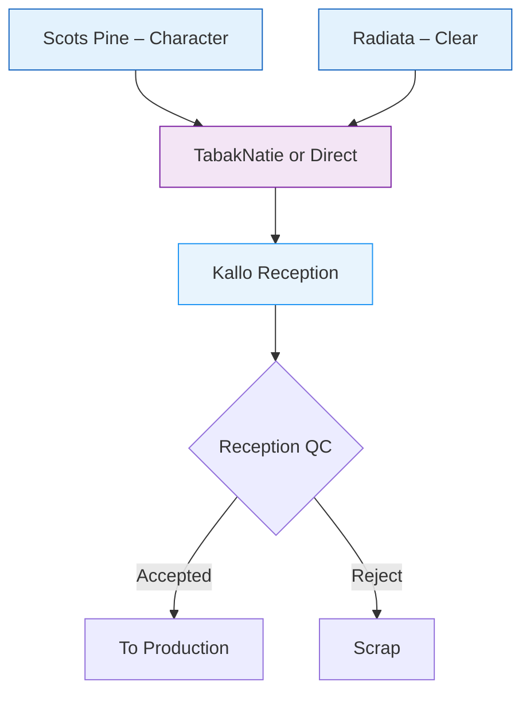
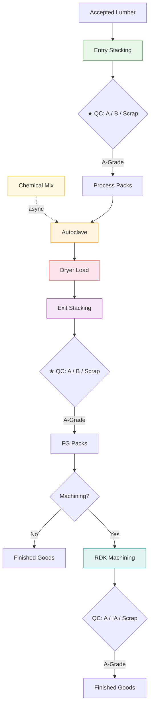
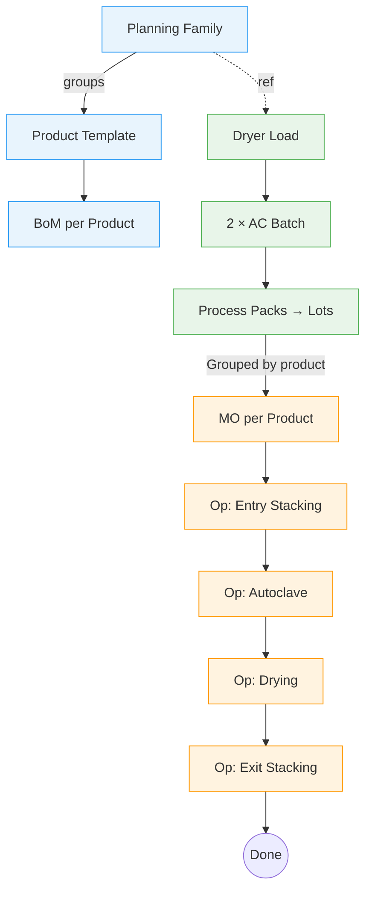

	# Kebony Manufacturing – Workflow Diagrams

## 1. Industrial Process Flow

The physical manufacturing flow from raw lumber reception to finished goods, with QC gates and stock valuation triggers.

### 1.1 Raw Material Supply & Reception

Two distinct product lines feed the Kallo plant:

- **Scots Pine → "Character" products** – Pre-machined before delivery (planed, profiled). Arrives ready for impregnation.
- **Radiata Pine → "Clear" products** – Arrives as rough-sawn lumber. Requires post-processing machining after kebonisation.



### 1.2 Core Production Process

From entry stacking through autoclave and dryer to exit stacking/destacking and finished goods. The **Dryer Load** is the atomic planning unit (1 DL = 2 Autoclave Batches). The **stacking machine is the primary QC gate** — every board is inspected during both entry and exit stacking.



### Key Process Notes

| Aspect | Detail |
|--------|--------|
| **Entry Stacking** | Boards sorted by Planning Family into **Process Packs**. No packaging materials consumed. **Main QC gate**: every board inspected → 3-way stock transfer (A-Grade / B-Grade / Scrap). |
| **Exit Stacking (Destacking)** | After dryer, boards restacked into **Finished Good Packs**. Packaging materials consumed. **Same QC gate**: board-by-board inspection with same 3-way grading. |
| **Same work center** | Entry stacking and exit stacking are two separate operations performed on the same stacking machine. |
| **Character line (Scots Pine)** | Pre-machined before delivery. After kebonisation → exit stacking → finished goods. Some Character products may route to RDK for **cut-to-length** operations. |
| **Clear line (Radiata Pine)** | Rough-sawn. After kebonisation → exit stacking → routes to RDK for **profiling and planing**. |
| **Dryer time** | Max ~80 hours depending on family (to be confirmed). |
| **Chemical mix** | ONE mix for ALL production. Async MO triggered by tank level. What varies per family is autoclave cycle duration, not the mix. |
| **TabakNatie data** | QC data transferred from TabakNatie to Odoo via SharePoint integration. |
| **Internal transfer** | TBK → Kallo is a planning element with lead-time impact on production scheduling. |

### QC Gates

| Gate | Location | Inspection | Outcome |
|------|----------|------------|---------|
| **Reception QC** | Reception (both species) | Initial screening, TabakNatie data via SharePoint | Accepted or Rejected |
| **★ Entry Stacking QC** | Stacking machine (main gate) | **Board-by-board** — every board inspected | A-Grade → Process Pack, B-Grade → B-Grade location, Reject → Scrap |
| **★ Exit Stacking QC** | Stacking machine (post-kebonisation) | **Board-by-board** — same inspection as entry | A-Grade → FG Pack, B-Grade → revalued, Reject → Scrap |
| QC After Machining | After RDK | Post-machining inspection | A-Grade → FG, IA (Industrial Article), or Scrap |

### Stock Valuation Triggers

| Event | Accounting Entry |
|-------|-----------------|
| Raw lumber reception | Dr Raw Inventory / Cr GRNI |
| Chemical mix produced | Dr WIP-Mix / Cr Raw Chemical, then Dr Ready-Mix / Cr WIP-Mix |
| Kebonisation complete (dryer done) | Dr WIP / Cr Raw Inventory + Cr Ready-Mix |
| Finished goods after destacking | Dr FG / Cr WIP |
| Machining at RDK (at standard) | Dr WIP-Machining / Cr FG (transfer), then Dr FG / Cr WIP-Machining (standard cost from price list) |
| Machining variance (at invoice) | Dr Machining Variance or FG revaluation / Cr WIP-Machining *(allocation rule TBD – INV-1)* |
| Sale | Dr COGS / Cr FG Inventory |

---

## 2. Odoo Implementation Architecture

How the physical process maps to Odoo objects and the `kebony_manufacturing` module.



**Colour key:** 🔵 Master Data → 🟢 Planning → 🟠 Execution

**DL Lifecycle:** `Draft → Planned → Locked → Done`

**MO grouping rule:** Process Packs containing the **same product** within a Dryer Load are clubbed into a **single Manufacturing Order**. One MO can consume multiple PPs.

**Work Centers (3):** Each consumes Kebony hours at a different €/h rate.

| Work Center | Operations | Notes |
|---|---|---|
| Stacking | Entry Stacking + Exit Stacking | Same machine, 2 operations |
| Autoclave | Impregnation | Cycle time varies by family |
| Dryer | Curing | Max ~80h, the bottleneck |

**Chemical Mix (async):** Separate MO triggered by tank level, not tied to production MO.

### Object Hierarchy

```
Planning Family (master data, 11 families)
 └─ Product Template (each product belongs to 1 family)
     └─ Bill of Materials (1 per product)
         ├─ Component: Raw Wood (product-specific)
         ├─ Component: Kebony Chemical Mix (family rate × m³)
         └─ Operations on 3 WC: Stacking (×2) → Autoclave → Dryer

Dryer Load (the atomic planning unit)  ← MES Drier #
 ├─ Autoclave Batch 1                  ← MES Autoclave #
 │   ├─ Process Pack 1 (Prod A)        ← MES Process Pack #
 │   ├─ Process Pack 2 (Prod A)        ← MES Process Pack #
 │   └─ Process Pack 3 (Prod B)        ← MES Process Pack #
 └─ Autoclave Batch 2                  ← MES Autoclave #
     ├─ Process Pack 4 (Prod A)        ← MES Process Pack #
     └─ Process Pack 5 (Prod C)        ← MES Process Pack #

Manufacturing Orders (grouped by product within DL)
 ├─ MO-1: Product A (PP 1 + PP 2 + PP 4)
 ├─ MO-2: Product B (PP 3)
 └─ MO-3: Product C (PP 5)
```

### Planning Families (11)

| # | Code | Species | Description | Dryer Hours (max ~80h, to be confirmed) |
|---|------|---------|-------------|----------------------------------------|
| 1 | KSP 1" | Scots Pine | 1" Cladding | TBC |
| 2 | KSP 1.5" | Scots Pine | 1.5" Terrace | TBC |
| 3 | KSP 2" PD | Scots Pine | 2" Pier Decking | TBC |
| 4 | KSP 2" CL | Scots Pine | 2" Cladding | TBC |
| 5 | KSP 2" CO | Scots Pine | 2" Construction | TBC |
| 6 | KRRS 1" | Radiata | 1" Clear | TBC |
| 7 | KRRS 2" | Radiata | 2" Clear | TBC |
| 8 | KR 1" | Radiata | 1" Standard | TBC |
| 9 | KR 1" CL | Radiata | 1" Cladding L | TBC |
| 10 | KR 1" PRE | Radiata | 1" Pre-machined | TBC |
| 11 | KR 2" | Radiata | 2" Standard | TBC |

### Key Design Decisions

| Decision | Rationale |
|----------|-----------|
| **1 MO per Product per DL** | Process Packs of the **same product** within a Dryer Load are grouped into a single MO. Reduces MO count and aligns with how production is tracked. |
| **Fixed 2 Autoclave Batches per DL** | Physical constraint: 1 dryer load = 2 autoclave loads, always. |
| **3 Work Centers** | Stacking (2 ops: entry + exit), Autoclave, Dryer. Each consumes Kebony hours at a different €/h rate. |
| **Planning Family drives BoM** | Shared operations + chemical rates. Only wood varies per product. |
| **Chemical Mix is async** | Separate MO, triggered by tank level. Not tied to production MO. |
| **ONE mix for all production** | Same Kebony Chemical Mix recipe. Autoclave duration varies, not the mix. |
| **Cubic meter is economic unit** | All margins, KPIs, and costing reconcile to m³. |
| **Planned vs Actual on all models** | Ready for MES integration. Actual fields populated post-production. |

### MES Traceability References

Each planning entity carries a reference number from the MES system for full production traceability. These are stored as fields on the corresponding Odoo models and populated either manually or via MES integration.

| Odoo Model | MES Reference | Field | Purpose |
|---|---|---|---|
| **Dryer Load** | Drier # | `kebony_mes_drier_ref` | Identifies the physical dryer run. Links all AC batches and PPs in the load. |
| **Autoclave Batch** | Autoclave # | `kebony_mes_autoclave_ref` | Identifies the autoclave cycle. 2 batches per DL. |
| **Process Pack** | Process Pack # | `kebony_mes_process_pack_ref` | Identifies the individual pack as stacked. Atomic traceability unit from MES. |

**Traceability chain:** A finished good can be traced back through:
`FG Pack → MO → Process Pack(s) → Autoclave Batch → Dryer Load` — each step carrying its MES reference number.

**MO ↔ MES link:** Since one MO can group multiple Process Packs (same product), the MO stores a list of MES Process Pack references. This enables reconciliation between Odoo production records and MES logs.

---

## 3. Open Backlog & Investigations

Items requiring further analysis or stakeholder input before implementation.

### 🔍 Investigations

| # | Topic | Description | Status | Priority |
|---|-------|-------------|--------|----------|
| INV-1 | **Machining subcontracting cost allocation** | RDK machining uses a **volume-dependent price list** (cost per m³ decreases with volume). The BoM is built using a **budget volume assumption**, but the actual bill from RDK arrives later. Real cost must be **allocated back to inventories**. Need to investigate: (a) how to model the price list in Odoo, (b) how to reconcile budget vs actual cost, (c) whether to use a variance account or revalue FG. | Open | High |
| INV-2 | **Planning Family validation & product linking** | Reduce from 21 to **11 families** (see table above). Updated dryer hours and parameters to be provided from revised XLS. Max dryer time ~80h (to be confirmed). **Next step:** validate the 11 families in Odoo, assign every product to its planning family, then push BoMs. | Pending data | **Next** |
| INV-3 | **TabakNatie → Odoo data flow** | QC data currently transferred via SharePoint. Assess feasibility of direct integration vs keeping SharePoint as middleware. | Open | Low |
| INV-4 | **TBK → Kallo transfer lead time** | Internal transfer from TabakNatie warehouse to Kallo plant is a planning constraint. Need to define standard lead time and model as inter-warehouse transfer in Odoo. | Open | Medium |

### 📋 Technical Debt

| # | Item | Notes |
|---|------|-------|
| TD-1 | Archive deprecated Ready-Mix products | `product_ready_mix_556` and `product_ready_mix_60` still in DB (noupdate). Need manual archiving. |
| TD-2 | Set Ready-Mix Product on all families | After reduction to 11 families, set `ready_mix_product_id` = "Kebony Chemical Mix" on each. |
| TD-3 | Planning family data XML cleanup | Remove or deactivate the 10 families that are being dropped in the reduction. |
