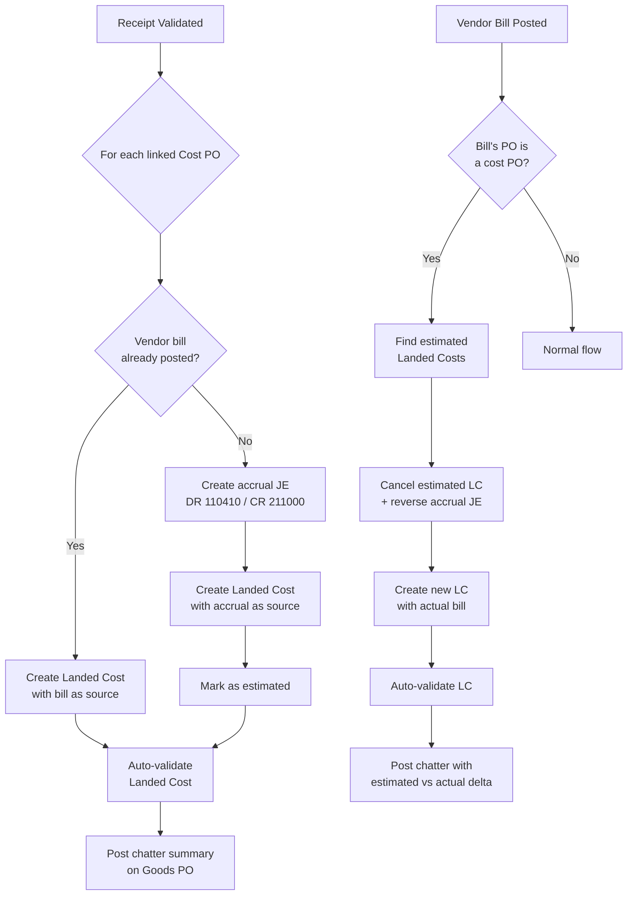
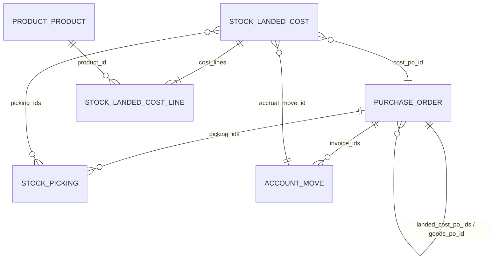

# Landed Cost Automation

**Scope**: Kebony Inc. (US entity) — Odoo 19
**Module**: `kebony_bol_report`
**Entity filter**: `x_kebony_entity_type == 'inc'`
**Status**: Phase 0 — Development complete, deployed to test (2026-03-23). Testing in progress.

> This document specifies the automation of landed cost accruals for
> inbound goods. It extends the manual process described in
> [[Accounting & Margin Architecture]] §Landed Costs with an automated
> PO-linking and accrual lifecycle. See also [[Consignment & Biewer]]
> for consignment-specific PO flows which are **excluded** from this
> automation.

---

## 1. Problem Statement

When goods are received from abroad (e.g. wood from Brazil), the
associated freight and customs costs typically lag behind the receipt by
days or weeks. The accounting team must manually:

1. Create an **accrual journal entry** with estimated amounts
2. Create an Odoo **Landed Cost** object linked to the receipt
3. Feed the accrual JE as source into the Landed Cost
4. When the vendor bill arrives, **reverse** the accrual and create a
   new Landed Cost with actual amounts

This process is error-prone:

| Failure Mode | Impact |
|---|---|
| Accrual forgotten at receipt time | Inventory undervalued; COGS distorted on first sale |
| Accrual created but not linked to receipt | Landed Cost has no picking → valuation layers not updated |
| Bill arrives but accrual not reversed | Double-counted cost in inventory; overstated GRNI liability |
| Estimate ≠ actual but delta not reconciled | Month-end clearing account does not zero out |

> [!warning] Financial Risk
> Until the accrual is correctly settled, inventory valuation is wrong.
> This cascades into COGS, margin calculations, and commission accruals.
> The manual process depends entirely on the discipline of the accounting
> team, with no system-level enforcement or visibility.

---

## 2. Solution Overview

Introduce **Linked Cost POs** — a relationship between a goods purchase
order and one or more cost purchase orders (freight forwarder, customs
broker, etc.). The system automates the full accrual lifecycle:

```
Goods PO ──has many──▶ Cost PO (freight)
                       Cost PO (customs)
                       Cost PO (insurance)
```

When a receipt is validated, the system inspects each linked cost PO and
takes the appropriate action automatically:



> [!tip] Parallel Operation
> During the transition period the automation can run alongside the
> manual process. Cost POs that are not linked to a goods PO are
> ignored by the automation — the team can adopt incrementally.

---

## 3. Data Model

### 3.1 New Fields

#### `purchase.order`

| Field | Type | Description |
|---|---|---|
| `landed_cost_po_ids` | One2many → `purchase.order` (inverse: `goods_po_id`) | Cost POs linked to this goods PO |
| `goods_po_id` | Many2one → `purchase.order` | Inverse — which goods PO this cost PO belongs to |
| `is_cost_po` | Boolean (computed, stored) | `True` if `goods_po_id` is set |
| `landed_cost_count` | Integer (computed) | Smart button badge: count of related `stock.landed.cost` |

#### `stock.landed.cost`

| Field | Type | Description |
|---|---|---|
| `accrual_move_id` | Many2one → `account.move` | The accrual JE created for this landed cost (for later reversal) |
| `is_estimated` | Boolean (default `False`) | `True` if created from an accrual estimate, not yet settled with an actual bill |
| `cost_po_id` | Many2one → `purchase.order` | The cost PO that sourced this landed cost (for traceability) |
| `goods_po_id` | Many2one → `purchase.order` (related via `cost_po_id.goods_po_id`) | Denormalised for easy searching/reporting |

#### `product.product` (service products only)

| Field | Type | Description |
|---|---|---|
| `default_landed_cost_split_method` | Selection | Default split method when this product is used as a landed cost line. Values: `equal`, `by_quantity`, `by_current_cost`, `by_weight`, `by_volume`. Default: `by_current_cost` |

#### `res.company`

| Field | Type | Description |
|---|---|---|
| `landed_cost_clearing_account_id` | Many2one → `account.account` | Landed Cost Clearing (default: 110410) |
| `grni_accrual_account_id` | Many2one → `account.account` | GRNI Accrual (default: 211000) |
| `landed_cost_journal_id` | Many2one → `account.journal` | Journal for accrual entries (default: stock journal) |

### 3.2 Relationships Diagram



---

## 4. Automation Triggers

### 4.1 Trigger 1 — Receipt Validation

**Override**: `stock.picking.button_validate()`

**When**: After `super().button_validate()` completes successfully.

**Logic**:

```python
# Pseudocode
def button_validate(self):
    res = super().button_validate()
    for picking in self.filtered(lambda p: p.state == 'done'):
        goods_po = picking.purchase_order_id  # or via move_ids.purchase_line_id.order_id
        if not goods_po or not goods_po.landed_cost_po_ids:
            continue
        for cost_po in goods_po.landed_cost_po_ids:
            posted_bills = cost_po.invoice_ids.filtered(
                lambda m: m.move_type == 'in_invoice' and m.state == 'posted'
            )
            if posted_bills:
                self._create_landed_cost_from_bill(picking, cost_po, posted_bills[0])
            else:
                self._create_landed_cost_from_accrual(picking, cost_po)
    return res
```

**Accrual JE creation** (`_create_landed_cost_from_accrual`):

| Line | Account | Debit | Credit |
|---|---|---|---|
| 1 | 110410 Landed Cost Clearing | PO total | — |
| 2 | 211000 GRNI Accrual | — | PO total |

- Amount = `sum(cost_po.order_line.mapped('price_subtotal'))`
- Journal = `company.landed_cost_journal_id`
- Reference = `f"LC Accrual: {cost_po.name} → {picking.name}"`
- Auto-post the JE

**Landed Cost creation** (both paths):

| Landed Cost Field | Value |
|---|---|
| `picking_ids` | `[(4, picking.id)]` |
| `cost_po_id` | `cost_po.id` |
| `vendor_bill_id` | Bill (if from bill) or `False` (if from accrual) |
| `accrual_move_id` | Accrual JE (if from accrual) or `False` |
| `is_estimated` | `True` (accrual) / `False` (bill) |
| `cost_lines` | One line per PO line (see §5) |

After creation, call `button_validate()` on the landed cost to update
valuation layers.

**Chatter message** on goods PO:

```
🔗 Landed Cost auto-created for receipt {picking.name}:
  • {cost_po.name} (Freight): $X,XXX — {"Actual (from bill)" | "Estimated (accrual)"}
  • {cost_po.name} (Customs): $X,XXX — {"Actual (from bill)" | "Estimated (accrual)"}
```

### 4.2 Trigger 2 — Vendor Bill Posted

**Override**: `account.move._post(soft=True)`

**When**: After `super()._post()` completes successfully.

**Logic**:

```python
# Pseudocode
def _post(self, soft=True):
    posted = super()._post(soft=soft)
    for move in posted.filtered(lambda m: m.move_type == 'in_invoice'):
        cost_pos = move.line_ids.purchase_line_id.order_id.filtered('is_cost_po')
        for cost_po in cost_pos:
            estimated_lcs = self.env['stock.landed.cost'].search([
                ('cost_po_id', '=', cost_po.id),
                ('is_estimated', '=', True),
            ])
            if not estimated_lcs:
                continue  # Bill arrived before receipt — handled at receipt time
            for lc in estimated_lcs:
                self._settle_estimated_landed_cost(lc, move)
    return posted
```

**Settlement** (`_settle_estimated_landed_cost`):

1. **Cancel the estimated LC**: `lc.button_cancel()`
2. **Reverse the accrual JE**: Create reversal of `lc.accrual_move_id`
   via `_reverse_moves()`, auto-post
3. **Create new LC** with `vendor_bill_id = bill`, same `picking_ids`,
   `is_estimated = False`
4. **Auto-validate** the new LC
5. **Post chatter** on goods PO with delta:

```
🔄 Landed Cost settled for {cost_po.name}:
  • Estimated: $X,XXX → Actual: $Y,YYY (Δ $ZZZ)
  • Accrual JE {accrual.name} reversed
  • New Landed Cost {new_lc.name} validated
```

### 4.3 Trigger 3 — EOM Dashboard

**Location**: `kebony.accounting.hub` (existing model in `kebony_bol_report`)

**New section**: "Pending Landed Cost Accruals"

| Column | Source |
|---|---|
| Receipt | `stock.landed.cost.picking_ids.name` |
| Goods PO | `stock.landed.cost.goods_po_id.name` |
| Cost PO | `stock.landed.cost.cost_po_id.name` |
| Vendor | `cost_po_id.partner_id.name` |
| Estimated Amount | `sum(cost_lines.price_unit)` |
| Days Since Receipt | `today - picking_ids.date_done` |
| Bill Status | `cost_po_id.invoice_status` |

**Highlighting rules**:

| Condition | Style |
|---|---|
| 0–14 days, no bill | Normal |
| 15–30 days, no bill | Warning (amber) |
| > 30 days, no bill | Overdue (red) |

---

## 5. Cost Line Mapping (PO → Landed Cost)

Each line on the cost PO maps to a landed cost line:

| Landed Cost Line Field | Source |
|---|---|
| `product_id` | PO line `product_id` (must be service type) |
| `name` | PO line `name` |
| `price_unit` | PO line `price_subtotal` |
| `split_method` | `product_id.default_landed_cost_split_method` (fallback: `by_current_cost`) |
| `account_id` | PO line `product_id.property_account_expense_id` or PO line account |

> [!note] Service Products Only
> Cost PO lines must reference service-type products (e.g. "Ocean
> Freight", "Customs Duties", "Cargo Insurance"). The system should
> validate this and raise a `UserError` if a storable product is found
> on a cost PO line when the PO is linked as a cost PO.

---

## 6. GL Account Configuration

### 6.1 Accrual Journal Entry Accounts

| Account | Code | Role |
|---|---|---|
| Landed Cost Clearing | 110410 | Debit on accrual; cleared when bill settles |
| GRNI Accrual | 211000 | Credit on accrual; reversed when bill settles |

Both accounts are configurable on `res.company` via Settings → Accounting
→ Landed Cost Automation.

### 6.2 Journal

The accrual JE uses `company.landed_cost_journal_id`. If not configured,
falls back to the stock valuation journal.

### 6.3 Journal Entry Lifecycle

```
Receipt validated (no bill):
  DR 110410 Landed Cost Clearing    $5,000
  CR 211000 GRNI Accrual            $5,000

Bill posted ($5,200 actual):
  Reversal:
    DR 211000 GRNI Accrual          $5,000
    CR 110410 Landed Cost Clearing  $5,000

  New Landed Cost validated with $5,200 from bill
  (Odoo native LC posting handles the valuation layers)
```

> [!tip] Clearing Account Balance
> At month-end the 110410 balance should be zero for all settled items.
> Any remaining balance represents open accruals (estimated LCs still
> pending a bill). The EOM dashboard surfaces these.

---

## 7. UI Changes

### 7.1 Purchase Order Form

**Goods PO** — new notebook tab "Linked Cost POs":

- Visible when `landed_cost_po_ids` is non-empty OR the PO's picking
  type is incoming (i.e. it is a goods PO)
- Inline tree view of linked cost POs showing: PO number, vendor,
  total amount, invoice status, landed cost status
- Button to add existing PO as a cost PO

**Cost PO** — header field:

- `goods_po_id` shown below the vendor field (read-only after confirmation)
- Visual indicator: banner at top "This is a Cost PO linked to {goods_po_id.name}"

**Smart buttons** (both PO types):

- "Landed Costs" button with badge count → opens list of related
  `stock.landed.cost` records

### 7.2 Product Form (Service Products)

- New field `default_landed_cost_split_method` in the "Accounting" tab
- Only visible for service-type products

### 7.3 Company Settings

- New section under Accounting → Configuration:
  - Landed Cost Clearing Account
  - GRNI Accrual Account
  - Landed Cost Journal

### 7.4 Accounting Hub

- New card in the existing dashboard: "Pending Landed Cost Accruals"
- Shows count badge + total estimated amount
- Click-through opens the detail list (see §4.3)

---

## 8. Edge Cases

### 8.1 Partial Receipt

Only the specific receipt being validated receives a landed cost. If a
goods PO has 3 receipts, each receipt triggers its own landed cost
allocation proportional to that receipt's value.

**Allocation logic**: If a cost PO total is $6,000 and the goods PO has
$100,000 total, but this receipt covers $40,000, the allocated landed
cost = `$6,000 × ($40,000 / $100,000) = $2,400`.

> [!note] Proportional Allocation
> The allocation ratio is based on the receipt's `move_ids` value
> relative to the total goods PO value. This ensures each receipt gets
> a fair share of costs even when goods arrive in multiple shipments.

### 8.2 Multiple Receipts on Same PO

Each receipt triggers independently. The system tracks which receipts
have already been allocated to avoid double-counting:

- Before creating a new LC for a cost PO + picking combination, check if
  one already exists
- If an LC already exists for this (cost_po, picking) pair, skip

### 8.3 Cost PO with Multiple Lines

Each PO line becomes a separate landed cost line on the same landed cost
object. For example, a single freight forwarder PO with lines for "Ocean
Freight" ($4,000) and "Terminal Handling" ($500) produces one LC with
two cost lines.

### 8.4 Bill Arrives Before Receipt

At bill posting time, the system checks for estimated LCs. If none exist
(because the receipt has not happened yet), **do nothing**. When the
receipt is later validated, it will find the posted bill and create the
LC directly from the bill — no accrual needed.

### 8.5 Bill Amount Differs from PO Estimate

The delta is handled naturally:

1. Estimated LC (e.g. $5,000) is cancelled → valuation layers reversed
2. New LC at actual (e.g. $5,200) is created → valuation layers updated
3. Net effect: $200 additional cost allocated to inventory/COGS

No special reconciliation logic needed — Odoo's native landed cost
valuation handles the adjustment.

### 8.6 Cost PO Cancelled

When a cost PO is cancelled (or its link to the goods PO is removed):

1. Find all `stock.landed.cost` where `cost_po_id` = this PO and
   `is_estimated = True`
2. Cancel each LC (`button_cancel`)
3. Reverse each associated accrual JE
4. Post chatter on goods PO: "Estimated landed costs removed for
   cancelled cost PO {name}"

### 8.7 Receipt Cancelled / Returned

When a receipt is cancelled or a return is processed:

1. Find all `stock.landed.cost` linked to this picking
2. Cancel the LC (native Odoo behaviour handles valuation reversal)
3. If the LC was estimated, also reverse the accrual JE

### 8.8 Currency Considerations

Cost POs may be in a different currency than the goods PO. The accrual
JE and landed cost amounts must be converted to the company currency at
the rate on the receipt date (not the PO date).

---

## 9. Security & Access

No new security groups required. The automation runs under the same
access rules as manual landed cost creation:

- `stock.group_stock_manager` for landed cost creation/validation
- `account.group_account_invoice` for JE creation
- The automation uses `sudo()` where needed, but logs all actions in
  the chatter for full auditability

---

## 10. Implementation Plan

### 10.1 Effort Estimate

| Task | Days |
|---|---|
| New fields + model extensions (`purchase.order`, `stock.landed.cost`, `product.product`, `res.company`) | 1 |
| Trigger 1: Receipt validation → LC/accrual creation | 2 |
| Trigger 2: Vendor bill posted → accrual settlement | 1.5 |
| Trigger 3: EOM dashboard integration | 0.5 |
| Testing + edge cases | 2 |
| **Total** | **7** |

### 10.2 Dependencies

| Dependency | Type |
|---|---|
| `stock_landed_costs` | Odoo native module (must be installed) |
| `kebony_bol_report` | Custom module (accounting hub, company config, entity filter) |
| `purchase` | Odoo native (PO model extensions) |

### 10.3 Rollout

| Phase | Scope |
|---|---|
| **Phase 0** — Development | Build + unit tests on staging |
| **Phase 1** — Parallel run | Enable on production, but do not disable manual process. Team validates automated LCs match their manual ones. |
| **Phase 2** — Full automation | Disable manual process. EOM dashboard becomes the single source of truth for pending accruals. |

> [!warning] Transition Period
> During Phase 1, both manual and automated landed costs may exist for
> the same receipt. The EOM dashboard should flag duplicates (same
> picking + same cost type) so the team can reconcile before going
> fully automated in Phase 2.

### 10.4 Timeline

- **Target**: Q3 2026 (post go-live)
- **Prerequisites**: Stable goods PO → receipt flow, cost PO vendors
  set up with correct service products, GL accounts 110410 and 211000
  configured

---

## 11. Testing Checklist

- [ ] Goods PO with one cost PO, receipt before bill → accrual + estimated LC created
- [ ] Bill posted after receipt → accrual reversed, actual LC created, delta logged
- [ ] Bill posted before receipt → no action; receipt then creates LC from bill
- [ ] Partial receipt → proportional allocation
- [ ] Multiple receipts → each gets its own LC, no double-counting
- [ ] Cost PO cancelled → estimated LC cancelled, accrual reversed
- [ ] Receipt returned → LC reversed
- [ ] Multi-currency cost PO → amounts converted at receipt-date rate
- [ ] EOM dashboard shows all pending estimated LCs with correct aging
- [ ] Chatter messages posted on goods PO for every automated action
- [ ] Smart buttons show correct counts on both goods and cost POs
